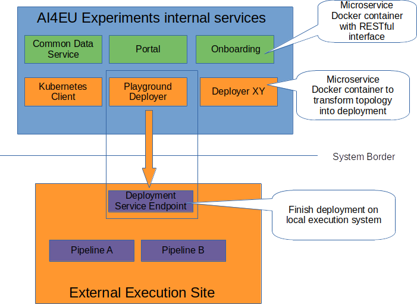
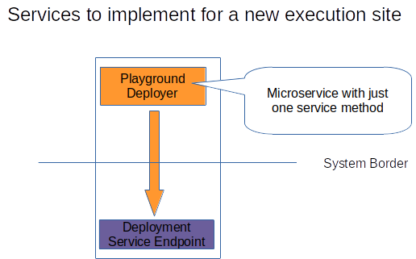

# Playground-Deployer

## Introduction
The architecture of AI4EU Experiments is designed to support the integration of many different 
deployment services for execution environments. Each deployment service is a separate 
microservice running inside the AI4EU Experiments cluster transforming the pipeline 
definition into deployment artifacts. There is for example the standard deployer for  
local Kubernetes (called internally kubernetes-client). It generates several kubernetes service.yaml and deployments.yaml 
files from the pipeline definition and creates a zip file for download containing 
them and adding a python script to finish the deployment on the target kuberntes 
cluster. If the deployment is not a single model but a pipeline, it adds automatically
the orchestrator to the deployments and handles the shared folder node.

In contrast to the kubernetes deployer, the playground deployer does not offer
the solution.zip for download, but instead sends it to the playground server
which handles then the further steps of local deployment on the playground 
kubernetes cluster.

A deployment service must take the following cases into account:
* the solution can be just a single model (= only one node)
* the solution can be a pipeline
* the pipeline can contain a shared folder node

A deployment service can be composed of two parts: the first running internally in the
AI4EU Experiments cluster and the second part runs on the target execution system to
finish the deployment and start the actual execution.

## Input parameters
Each deployment service is called with the following input parameters:
* solutionId
* revisionId
* JWT authentication token

SolutionID and revisionID together uniquely identify the pipeline to deploy. After
checking the JWT authentication to ensure that the request is genuine, the file 
blueprint.json, which contains the pipeline topology can be retrieved from the 
persistence service. If the solution is not a pipeline but a single model, 
the handling is described further down.

How the deployment service transforms the pipeline definition into a specific deployment
is completely up to the service. That holds also for the programming language or authentication
to remote systems.

## Processing the Pipeline definition blueprint.json 
The file **blueprint.json** contains the nodes and edges forming the pipeline. For 
the deployment, only the nodes are relevant, not the edges. The most important
attribute of a node is the **docker image URL**: it is the reference to the public
or private registry where the asset provider has stored the image.

The deployer iterates over all nodes:
* if the node is a **shared folder provider**, a kubernetes persistent volume claim is generated _and the node is removed from blueprint.json_
* for any other type, the **docker image URL** is read from **blueprint.json** 
* one **service.yaml** and one **deployment.yaml** is created for each node
* the **protobuf file** for the node is fetched from the database and added to the solution.zip
* the deployer automatically adds the **orchestrator node** to the deyloyment. The orchestrator is importatnt for execution as it dispatches the messages to the nodes along the edges.

Moreover, the playground deployer contains a python script to finish the local deployment. (kubernetes-client-script.py)

The Playground deployer assumes a new namespace for each pipeline.

**Important:** The persistent volume for a shared folder is expected to have accessMode **ReadWriteMany** because all node of a pipeline need to have the same level of access

## Processing for a single model

For a single model, the docker image URL is read from the database and exactly one service.yaml and one deployment.yaml is created.

The Playground deployer assumes a new namespace for each single model deployment. (kubernetes-client-script.py)

